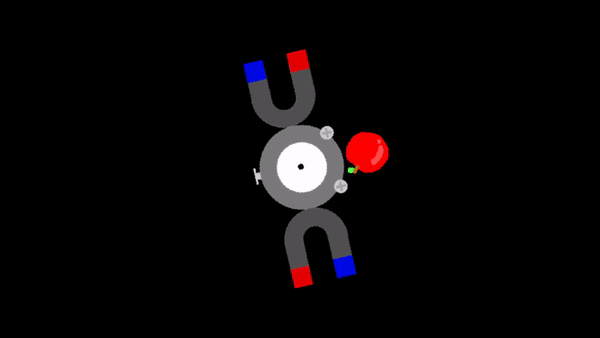

# [Lania](https://github.com/Jean-LouisH/Lania)

**Note: This engine is experimental in nature and is under alpha development. The runtime feature set is incomplete and there is currently no implementation of the scene editor. It is not currently suitable for creating applications.**

[Lania](https://github.com/Jean-LouisH/Lania) is **a hobbyist and experimental 2D/3D game engine**. 

It is named after the [Laniakea Supercluster](https://en.wikipedia.org/wiki/Laniakea_Supercluster). Laniakea is Hawaiian for "immeasurable heaven". This relates to the engine's representation of physical space and also the endlessness of its feature support for the future.

It is being developed as a personal exercise in applying my learning outcomes from university and reading. I also intend to use it as a testbed for small real-time simulations, scientific visualizations, artificial intelligence algorithms and games.

For the sake of learning, select portions of the engine will be made from my own code rather than existing solutions. My learning objectives include; 
* [Scene Architecture & Management](https://en.wikipedia.org/wiki/Scene_graph); 
* [Cache Locality](https://en.wikipedia.org/wiki/Locality_of_reference) Optimizations;
* [Multithreading](https://en.wikipedia.org/wiki/Thread_(computing)#Multithreading); 
* [Profiling](https://en.wikipedia.org/wiki/Profiling_(computer_programming)); 
* [Physics, Collision Detection & Response](https://en.wikipedia.org/wiki/Collision_detection); 
* [Audio Programming](https://en.wikipedia.org/wiki/Game_engine#Audio_engine); 
* [Real-Time Rendering](https://en.wikipedia.org/wiki/Real-time_computer_graphics); 
* APIs such as [Simple DirectMedia Layer (SDL)](https://www.libsdl.org/), [PortAudio](http://www.portaudio.com/) and [OpenGL](https://www.khronos.org/registry/OpenGL/specs/gl/glspec33.core.pdf).

among others.

## Documentation

* [Architecture](Documentation/Architecture.md)
* [Entity Component System](Documentation/EntityComponentSystem.md)

## Contributing

* Jean-Louis Haywood (Jean-LouisH)

## License

[MIT License](LICENSE)