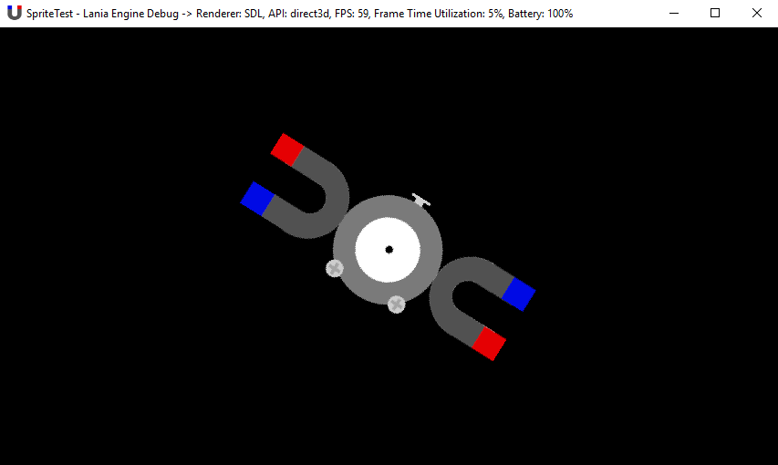

# [Lania](https://github.com/Jean-LouisH/Lania)

**Note: This engine is experimental in nature and is under alpha development. The runtime feature set is incomplete and there is currently no implementation of the scene editor. It is not currently suitable for creating applications.**

[Lania](https://github.com/Jean-LouisH/Lania) is **a 2D/3D engine for real-time simulations and games**. 

It is named after the Laniakea Supercluster. Laniakea is Hawaiian for "immeasurable heaven". This relates to the engine's representation of physical space and also the endlessness of its feature support for the future.

It is being developed as a personal exercise in applying my learning outcomes from university and reading. I also intend to use it as a testbed for small real-time simulations, scientific visualizations, artificial intelligence algorithms and games.

My learning objectives include; scene architecture & management; file parsing & formatting; cache locality optimizations; multithreading; data structures; profiling; physics & collision algorithms; audio programming; rendering; and APIs such as Simple DirectMedia Layer (SDL), PortAudio, OpenGL and Vulkan.

## Documentation

* [Architecture](Documentation/Architecture.md)
* [Entity Component System](Documentation/EntityComponentSystem.md)